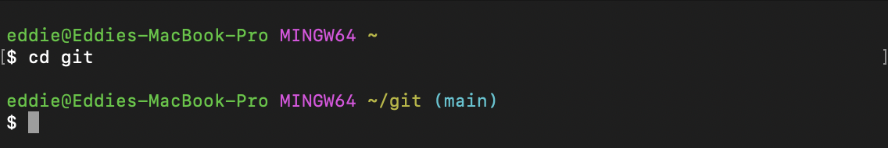

# gitbash theme for zsh

A zsh prompt theme that mimics the default prompt from [Git for Windows][gitwindows].



[gitwindows]: https://gitforwindows.org/

# Quick setup

1. Clone this repo somewhere, for example `~/repos/gitbash-zsh-theme`.
2. Add the following to your `~/.zshrc`:

```zsh
fpath=(~/repos/gitbash-zsh-theme/functions $fpath)
autoload -U promptinit
promptinit
prompt gitbash
```

Replace `~/repos/gitbash-zsh-theme` with wherever you cloned this repo.

# Customization

Love git bash, but hate `MINGW64`? Well, lucky for you, you can change
it to whatever you want. `prompt gitbash` takes one argument, which
allows customizes this string:

```zsh
prompt gitbash 'Your string here!'
```

# Full installation instructions

This prompt is built using zsh's awesome [prompt theme system][prompt].
There's a few things that the prompt theme system needs:

First, a file called `prompt_$THEME_setup` to be somewhere on your
[`$fpath`][fpath]. You can either copy `functions/prompt_gitbash_setup`
to a directory on your current `$fpath` (Protip! Check which directories
are on your `$fpath`  with `typeset -p fpath`) or append this repo's
`functions` dir to your `$fpath` (recommended).

Then you need to initialize the prompt system:

```zsh
autoload -U promptinit
promptinit
```

Finally, you can use the `prompt` command to choose any prompt in your
`$fpath`. You can list all the prompts available with:

```zsh
prompt -l
```

You can preview prompts with:

```zsh
prompt -p $THEME
```

Or preview all prompts with:

```zsh
prompt -p
```

You can even change themes during sessions:

```zsh
prompt gitbash
prompt restore
```

[prompt]: https://zsh.sourceforge.io/Doc/Release/User-Contributions.html#Prompt-Themes
[fpath]: https://zsh.sourceforge.io/Doc/Release/Functions.html#index-autoloading-functions

# Inspiration

I used the file from the Git for Windows installation, namely, [git-prompt.sh].

[git-prompt.sh]: https://github.com/git-for-windows/git-sdk-64/blob/main/etc/profile.d/git-prompt.sh
